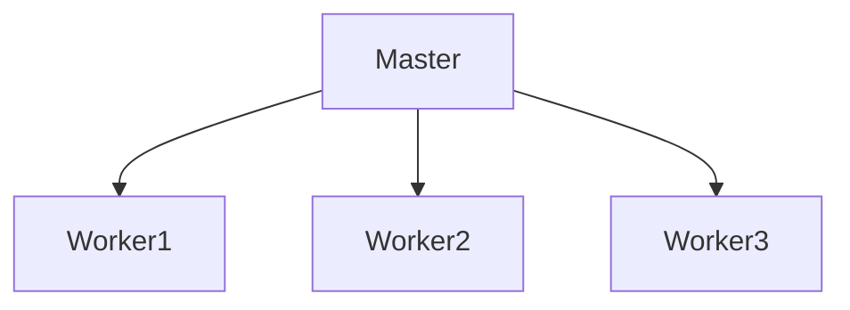
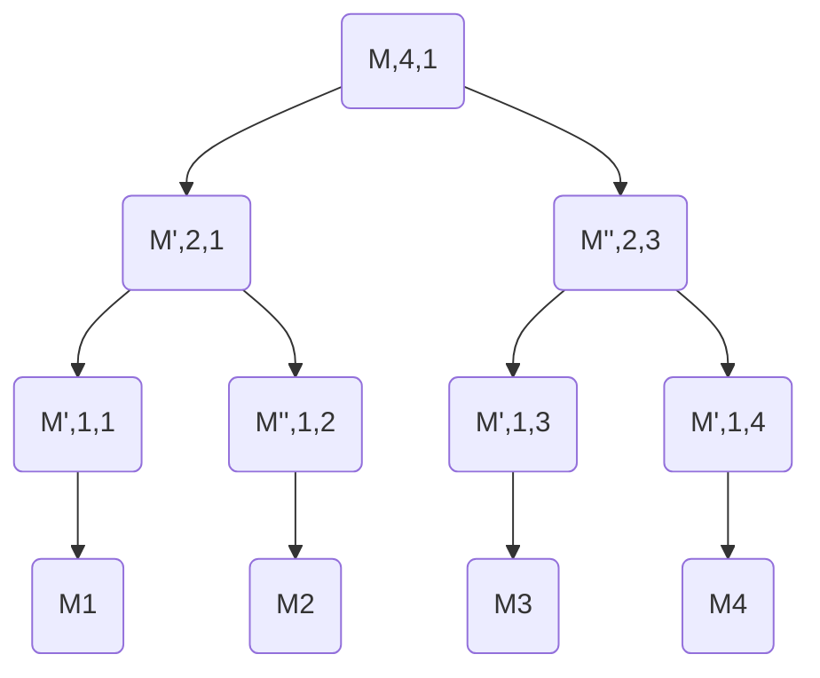
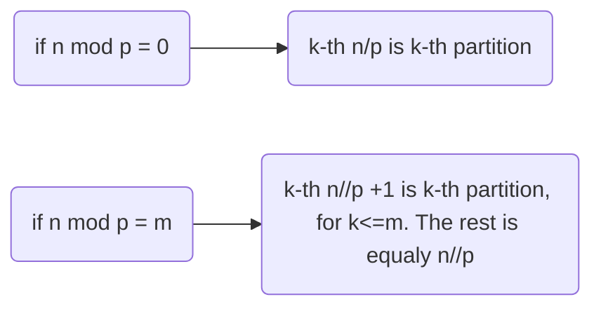
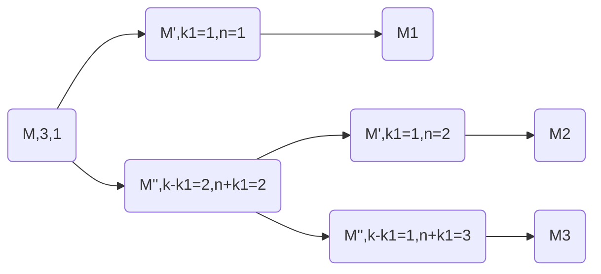

- 这里是一个目录
{:toc}

# Summary Chapiter 3 Partionning a mesh

## Lecture 1 - Intro and some method

### **Task farming**

### **Recursive bisection**

M: mesh to be partitioned

k: $2^i$, task number

n: id of partition

Iteration(M,k,n), every iteration, bisection M to (M', M''), k -> k/2, n->(n,n+k)

### **Node and element based partitioning**

### **Complexity**

- P： 在多项式时间内可以解决的问题。如大小为n的问题，时间为$O(n^k)$
- NP: 在多项式时间内可以验证结果正确与否的问题。

对于NP问题$O(n^k)$，提高CPU性能有助于加快运行时间，但是对于非NP的问题，并没有显著作用。

partition 的复杂度计算：假设有n个元素的mesh，需要分成p块，每块k个元素。那么最后可以有$\frac{1}{p!}\tbinom{n}{k} \tbinom{n-k}{k}...\tbinom{2k}{k}\tbinom{k}{k}$种可能性。(n较大时巨大)因此可以选用经验或近似方法。

### **Methods based on element orders**

Consider the id number of elements and their order. The quality of partition can be good or bad.

#### Optimal method.

Try all possible combinations, exhausteive, <~50 elements.

#### Linear order method

n element, p pieces.

#### Scatter method

(Partition id) j = (element id) i mod p.

#### Random method

for every element, generate a random integer (0, p-1) which is the partition number.

The method will influence the communicaiton nodes between partitions.

### **Geometry based methods**

- The geometry specifies the positions and coordinates of the nodes.
- The topology specifies the arrangements of the elements, e.g. the nodes of the elements, adjacency of the elements.

- coordinates of the nodes are available.
- usually very fast, mainly uses the recursive bisection method.

#### Recursive coordinate bisection

Idea: **cutting plane -> 垂直coordinate axis -> the one in which direction the mesh has the longest extension.**

Advantage: can be 3D

Drawback: not fit for complex geometry(会有island), 切割质量与坐标系有关。

#### Recursive inertial bisection method

- **The first order moment** of a 2D geometric object corresponding to **axis x** is : $S_x = \int_A y dA$. dA is small surface.
  - **Rule of component**: if $A \cap B = \phi$, then $S_{x,A}+S_{x,B} = S_{x,A\cup B}$
- $S_x = \int_A y dA = A \bar y$, $S_y = \int_A x dA = A \bar x$, where $(\bar x, \bar y)$ is the **center of gravity**. $\Longrightarrow \bar x = \frac{S_y}{A}, \bar y = \frac{S_x}{A}$.
- **The second order moment**, the inertia: $I_{xx} = \int y^2 dA > 0$, $I_{yy} = \int x^2 dA >0$, $I_{xy} = \int xy dA$.  Rule of component.
- **Steiner's theorem** (Translation of axis): if old and new axis(x' and x1) is parallel, 
- 
- Mohr's theorem:
  - 一般是对称轴
- 通常选择通过重心分割。这个方法考虑了模型的朝向。

---

## Lecture2 - greedy method

**Problem**: n 个元素，分成p块，如果不能整除，设余数为r。

1. 确定每个node连接的element数量，叫做权重。

2. 选择最小非零权重的node开始分。

3. 选择相邻的所有elements归入parition。与该element相连的node权重-1。

4. 确定该element的一些neighbouting（共同edge的element）

5. 选其中的一个邻居进入partiiton。与该邻居相连的node权重-1。

6. 如果paritition未满，重复4。

   **在parition内部的node权重必须为0**

7. 重复2， 选择在边界有最小非零权重的node开始分。

8. 最后只剩下一个partition未分配，所有的未分配元素都归到这个partition中。程序停止。

---

## Lecture3 - graph partioning, space-filling curve, spectral bisection

### **Graph**

- Definition: **graph = G(V, E)**, V: nodes(1,2,3,...), E: edges. Edge(i,j) represent edge from node $v_i$ to nodes $v_j$.
- Nodal graph & Dual graph. 

### Representation of graphs

#### Neighbouring matrix

$A = (a_{i,j})$, a_ij = 1 if edge between i and j, =0 if not

#### Neighbouring list

#### Compressed sparse row 压缩稀疏行

- A是一个稀疏矩阵
- JA 数列数从0开始
- IA里面第一个元素是0
- 带宽  bandwidth：非零元素离对角线的最远距离。此处为1.

### Graph partitioning

#### Method

1. 一个有向图G = G(V, E)
2. node v和edge e 可以有权重$c_v$和$c_e$，可以代表任何性质。
3. graph portioning algo把G分为p个部分，满足$V = V_1 \cup V_2 \cup ... \cup V_p$
4. 目的：子图的nodal weight相等，切割的edge最少。

### Recursive graph bisection

**Graph distance**: $d(u,v)$ = node u, v 之间的最短路径(可带权重)

Idea: 先确定最长距离的两个node，其中一个叫v。按离v的距离远近给所有的node排序，最后nodes分为两部分，也就是两个partition。问题：如何确定最远距离？NP 完全。

#### Cuthill-Mckee algorithm(reduce the bandwidth)

Idea: 更改node的序号，整个图不变，但是对应的矩阵会变，使得bandwidth更小。

1. 建立空序列Q，空向量R。
2. 从图中选一个node加入Q。
3. 令 P = Q的第一个node，如果P不在R中，加入R。pop（Q）
4. P的所有不在R中的邻居，都根据其重数从高到低？（degree）加入Q。
5. 如果Q非空，回到3.
6. 如果Q空了，检查所有node中是否有没有在R中的node，说明G是有分离部分，对于那一部分重新从2开始。
7. Reverse Cuthill-McKee，反转R中的node顺序。

- 如何选择起始点？
  - 选择一个node r, 生成 level structure, $L_0(r),L_1(r),...,L_{k(r)}(r)$, where $L_0(r) = r$, k(r)是number of levels.
  - 选择$L_{k(r)}(r)$中degree最小的node s，生成$L_0(s),L_1(s),...,L_{k(s)}(s)$ k(s)是level数量。
  - 如果k(s) > k(r), r 变为s，重新开始第一步。最后s成为pseudo-boundary node.

### Space-filling curve

#### Hamilton cycle of graphs

遍历所有node（只一次）最后回到起始点的一条路径。

- NP完全问题。但不能确定是否存在这条路径。
- 可以用element adjacency,和nodal adjacency.

### Spectral bisection

**Laplace matrix**: L = L(G) = D - A

- L is real, symmetric, positive, semi-definite.($\forall z, z^TLz \geq 0$) its eigenvalues λ1 ≤ λ2 ≤ · · · ≤ λn are real. Their eigenvectors are also real.

- 最小的特征值为0，第二小的大于零。$\lambda_1=0,\lambda_2>0$.
- 第二小的特征值和特征向量与图的连通性有关。可用于图的分解。（Fiedler）

**具体算法：**

1. 建立Laplace matrix L
2. 确定L的第二小特征值和特征向量：$\lambda_2,\underline{\eta}_2$
3. 计算$\underline{\eta}_2$中的平均值$\overline{\underline{\eta}_2}$
4. partition A: $A = {v_i \in V |\underline{\eta}_{2,i}\leq \overline{\underline{\eta}_2}}$, partition B: $B = {v_i \in V |\underline{\eta}_{2,i}> \overline{\underline{\eta}_2}}$
5. 可以使用此方法继续分子图。

- 如果要分成四个部分，会涉及第二和第三小的特征值
- 如果要分成八个部分，会涉及第二、第三和第四小的特征值。

## Lecture4 - Multilevel methods, Kernighan-Lin method, Helpful-set method, Aspect ratio

**这一节，在讲述partition的一种框架叫做multilevel method**。这个方法主要有三步：

- **第一步，合并一些node，也叫coarsening**，目的是减少图的复杂度。coarsening有多种方法，我们学到的比如Hendrickson-Leland-algorithm, heavy edge matching(HEM)等等。
- **第二步，将合并后的图进行分割，叫做initial partitioning**。有很多方法，如之前学过的spectral bisection，recursive bisection等等。
- **第三步，是将那些合并的点还原到原图，叫uncoarsening，或者improvement。** 包括Kernignan-Lin method, helpful-set, aspect ratio等。 这一步是由于，简化后的图的最优分割，不一定是原图中的最优分割，需要有一些点要做微调。

### Multilevel methods

#### Coarsening

clustering and matching. 

以下是几种coarsening的方法：

**Hendrickson-Leland-algorithm**

任意选两个相邻节点，合并，并重新计算该节点的权重，以及与其相连的edge的权重。

**Heavy Edge Matching**

任选一个node，合并其权重最大的edge的node

**Light Edge Matching**

**Matching with clique**： 所有的节点都互连，选择一个子图，也符合clique，edge的密度最大（不知道啥意思）。没有算法想要切割clique。

### Initial parititioning

coarsening的一些问题：

- 最后node的权重可能不近似相同。
- Several coarsening-uncoarsening
- 特殊情况下这种不平衡会帮助partitioning
- 通过上述几种方法，不容易partitioning

### ”Uncoarsening”and smoothing

问题：coarsening以后的最优cut，不一定是原图的最优cut。

改进算法：（下一节的讲述：Kernighan and Lin algo, Helpful-set ,aspect ratio）

- 有必要进行一些initial partitioning。
- 这些算法是local的。

#### Kernighan-Lin method

这个方法假设G被分为A和B，寻找A，B中的两个node a，b，如果把a放入B，把b放入A，cut edge会减少。

几个公式：

- 外部cost: $E_a = \sum_{x \in B}c_{a,x}$，与a相连的B外部的edge（包含权重）
- 内部cost: $I_a = \sum_{x \in A}c_{a,x}$, 与a相连的A内部的edge（包含权重）
- $D_a = E_a-I_a$, 此数值越大说明a连的外部edge越多，a最好在另一边。
  - 

- 交换a，b产生的gain: $g = D_a+D_b-2c_{a,b}$, $c_{a,b}$是weight of the edge between nodes a and b. **$c_{a,b}$只有当a，b相连的的时候才有数值，否则是0.**
- 交换a，b, $\forall x\in A-\{a\},D_x' = D_x+2c_{x,a}-2c_{x,b}$
  - 

**具体算法**

1. 初始化设每个graph的node都是free。
2. 确定每一个node的D值。
3. 选取A，B中的两个node a，b，满足交换以后的gain g值最大。
4. 记录这两个node number 和 g，记为non-free. **但现在并不交换他们**。
5. 假设交换发生，并更新每个与a，b相连的node的D值。
6. 如果还有free node，重复3。
7. 如果没有free node， 那么我们会记录下一系列的交换node(ai,bi), 和对应的g。
8. 选取下标k，使得$G = \sum_{i=1}^{k}g_i$最大。
9. 如果$G\geq 0$, $(a_1,...a_k)放到B，$和$(b_1,...,b_k)$放到A。
10. 如果$G \leq 0$, 停止。如果G = 0，局部最优。

注意：

- 在k个g值中有些g可能是负数。这是爬山特点hill-climbing property.

- mark the nodes free and non-free repeatedly, because in this way we can avoid trashing of the algorithm.

#### Some modification

**The Fiduccia and Mattheyses algorithm**

这个算法只移动一个node，会导致两个partition node数量不同。我们可以有一个balancing condition $r = \frac{C_A}{C_A+C_B}$,这个r值可以由user决定。其中$C_A,C_B$是A，B中node的权重之和。

$g = D_a+D_b-2c_{a,b}$, D = E-I 外部cost-内部cost。**这里的g不太确定到底是什么，尤其是最后是否是只减一个c？因为并不是交换他们而是直接加入**。

|      | Kernighan and Lin algorithm |  Fiduccia and Mattheyses algorithm    |
| :--: | :-------------------------: | :--: |
|   complexity of the algorithm   | $O(n^ 2 )$ | $O(n)$ |
| node movement | in pairs | one-by-one |
| selection of nodes | gain from the swapping of two nodes | gain from the movement of one node |
| balance | keeps the balance | may be modified up to a limit |

**Unequal parititions**

- Use of dummy nodes
- 假设要分为node数为n1和n2的两个partition，先随机切割成n1 和 n2数量node的partition，然后用Kernighan-Lin algo，但在公式$G = \sum_{i=1}^{k}g_i$中k的最大值为min(n1,n2)。

#### "Helpful-set" method 在Kernignan-Lin基础上的改进

注意，第一步的操作，cut edge数量减半。

#### Aspect ratio

**Aspect ratio according to Walshaw**

- node 的权重就是element的体积（面积）
- edge的权重就是surface的大小（边长）
- 两种matching方法：

**Farhat’s method**

$min(\alpha\times comm(M)+\beta\sum_i^P(n_i-\frac{n_M}{P}+\gamma AR))$

- **comm(M)** is the amount of communication between the partitions in finite element mesh M
- **P** is the number of partitions
- **ni** is the number of finite elements in partition i
- **nM** is the number of finite elements in mesh M

$AR = \sum_{i=1}^P(\sum_{j=1}^d(\sum_{k=1}^{n_i}(x_{ijk}-\bar x_{ij})^2))$

- P is the number of partitions
- d is the number of dimensions
- ni the number of elements in partition i
- x the coordinate of the centre of the element and  $\bar x$ is the coordinate of the centre of the partition.

**Simulated annealing**

- 系统的能量从E1到E2的概率为$p = exp(\frac{-(E_2-E_1)}{kT})$, k: Boltzmann constant and T ：温度
- 如果E2<E1,p=1，一定会发生转变。但也有一定几率向能量高的状态转变。

---

## Lecture5 - CHACO, PMETIS, KMETIS, JOSTLE

这一节是上一节的延续，列举了几种multilevel 的方法，如pmetis，kmetis，每个方法包含了coarsening，initial partition和improvement三步。

### CHACO ：Kernaghan-Lin 的修改

可以处理任意数量的partition。

- 如果有P个partition，会有P(P-1)个不同的graph node 移动，因此需要相同的数据结构。
- 
- The move with the largest gain will be performed by the algorithm

- D值只会在移动的node的邻居中更新
- 对于内部的点，不用计算D。只有点在边界处的时候才用计算

### PMETIS

首先，关于coarsening的方法，之前说的三种方法: heavy edge matching, light edge matching, heavy clique matching. Coarsening会直到node数量少于100的时候停止。

有三种PMETIS 的initial partitioning

- spectral bisection
- graph growing algo
- greedy graph growing algo

#### graph growing algo

1. 选取一个任意node，作为一个partition中的node。
2. 这个node的邻居全部归入到这个partition。
3. 继续这样直到整个图的一半的node都被选完（或者一半的node权重）

有点类似贪心算法。**并且会被初始点影响较大，因此通常会随机选10个不同的初始点。**对于小规模coarse graph非常快。选最好的那个结果。

#### greedy graph growing algo

1. 随便选一个node，作为partition的第一个node。
2. 计算这个node和邻居node的gain value 以表示如果选择了这个node后cut edge的变化：$g = D_a+D_b-2c_{a,b}$, D = E-I 外部cost-内部cost。**这里的g不太确定到底是什么，尤其是最后是否是只减一个c？因为并不是交换他们而是直接加入**。
3. 选取最大的那个gain对应的node，加入这个partition。
4. 更新并重复。已刚加入的node为主选他的邻居。

**依然是受初始点影响较大，一般会从4个点开始。**对于小规模coarse graph非常快。选最好的那个结果。

### KMETIS

需要分成k块。

- 首先nodes按照权重大小排，并使用HEM(heavy edge matching)。
- 这个方法会减少nodes在新图中的平均权重。
- 最后的coarsening有两种情况。
  - nodes数量小于 c k  = 15，k是partition数量。
  - 最后一步coarsening nodes数量减少为上一步的0.8倍以下。

- 通常结果会与最优解相差很大。
- 如果graph是有有限element生成的，这个算法可以和其他的k-way partitioning算法一样有效。

**improvement**

- ”Greedy Refinement”method : Kernighan-Lin method without the hill-climbing capability
- ”Global Kernighan-Lin Refinement”method : Kernighan-Lin method with global row

**PMETIS 一般是8个partition，KMETIS大于8个**

### JOSTLE

- **coarsening** : modified ”Heavy Edge Matching”。  in the case when there are two edges with the same weights from a node, then the algorithm chooses the edge which is connected to a node with smaller degree.
- **Initial partitioning** : the coarsening continues until there are only k nodes. The improvement algorithm considers the sum of the weights in the partitions and during improvement the weights are balanced.
- **improvement algorithm**: special and complex. it considers the unbalanced partitions

---

## Lecture6 - Type of graph, Bubble graph, Bipartite graph, Hyper graph

### Problems

在graph中切割一条edge就会产生一个communication在两个partition之间。**但是在communication的数量和cost之间并没有之间联系**。（信息发送需要的时间和start-up time和信息量大小都有关）。**partitioning考虑最小化信息量大小，但是不考虑start-up time**。

**为什么 partitioning会有用？**原因是我们的graph通常是来源**finite element meshes**，**node的邻居很少**，这个性质可以最小化bad cut的影响。有限element还会有**较高的degree of geometric locality**，意味着**用来表示finite element的node在集合上互相邻近**。Finite element几乎是**homogeneous**，所以**partition也会几乎相似**。

#### Possible solutions

- keep the original graph representation and we try to minimize the true amount of communication.
- New type of graph representation
  - communication graph
  - bubble graph
  - bipartite graph
  - hyper graph
- Optimization with several objective functions

### Type of graph

#### Communication graph

#### Bubble graph

#### Bipartite graph

例子：矩阵。G = (V1,V2,E). V1的每一个node代表每一行，V2代表每一列。只有非0元素对应的行列的node之间才会有edge。

- V1 and V2 are partitioned separately
- If V1 and V2 represent the same elements, then the method allows the partitioning of the same problem by two different methods。？？？

#### Hyper graph

It is the general case of a graph.

A hyper graph contains nodes (V) and hyper-edges (Eh), **where one edge is a subset of several nodes (not only two).**

**hmetis, graph edge coarsening**

**Initial partitioning**

可以用任何的简单方法，之后会有improvement。

**Improvement**

- Fiduccia and Mattheyses algorithm
- A second algorithm tries to ensure, that every node of a hyper edge should belong to the same partition
  - The algorithm goes through all hyper edges and checks whether the nodes of an edge belong to different partitions.
  - If yes, then the algorithm checks whether the nodes can be moved to the other partition or not.
  - The movement cannot make the number of cut edges worse.
- The coarsening and uncoarsening steps are executed several times
- Limited coarsening means, that there is already a partitioning of the hyper graph and during the improvement process only those nodes are merged that are in one partition.
- The uncoarsening is unchanged.
  - V-cycle : The coarsening and uncoarsening steps are executed at a full cycles
  - v-cycle : The cycle iterates between the coarsest graph and a graph with half of the nodes
  - vV-cycle : combination

---

## Lecture7 - Dynamic load balancing, repartitioning, diffusion method, dimensions, the gradient method, future of partitioning

### Dynamic load balancing动态负载均衡

- Repartitioning of the full finite element mesh
- Migration of elements between partitions with common boundaries

四个基本问题：

- 计算load的方法the method of measuring the load ;
- 信息交换的方法和规则the method and rules of information exchange ;
- load balancing的starting rule
- load balancing 方法

#### The method and rules of information exchange

#### Starting rule for load balancing

-  sender initiated
- receiver initiated
- periodic

#### Load balancing

- Who are the partners in load balancing ?

- How to distribute the load ?

### Repartitioning

- Rows : Original partitioning
- Columns : New partitioning
- Element of matrix $S_{i,j}$: how many elements of the original partition i falls in the new partition j

Partition要满足$\sum_{i=1}^P\sum_{f=1}^FS_{i,f}$最大(但貌似是个常数？)。P是原始partition数量，F是新的partition数量。

The method minimizes the migrated amount of data between the partitions during the load balancing.

### Diffusion method

这个例子里似乎都是取整了。

### Dimension

#### Balancing along the dimensions

- diffusion method assumes that a given computer communicates with its neighbours at the same. 同时传输信息给所有邻居，但电脑一般做不到。
- A computer communicates only with a set of neighbours, then the rest of the neighbours

- If the computers are arranged in a hypercube, then the computers can be **labelled according to the dimension.**
- Neighbouring nodes, that are connected by a graph edge, **differ only in one bit**

- **Sending messages only along on dimension**
- Broadcast message in three steps. This is ordering of the messages.

#### Generalisation of the method

- Arbitrary graph and its coloring.涂色问题
- The graph edges are colored with minimal colors in such a way, that the neighbouring graph edges should not have the same colors. In this way one color is one dimension.
- 

1. Select a color and balancing should be send along those edges that have this color

2. Then take the next color and do balancing

3. and so on.

   that the method converges.

## The gradient method

- The less loaded computer initiates the process
- The overloaded computers start sending the unfinished load in the direction of the less loaded computers.
- The load flows through the system according to a gradient surface.

The gradient surface is determined by the **propagation pressure pi** :

where pj is the propagation pressure of the **neighbouring computers**. Basically this value specifies, that a **less loaded computer is how many steps away.**

过度负载的计算机会按照更少负载的方向发送一部分负载。

两种情况：

- 数据传送到了少负载的计算机
- 其他数据传送到了少负载的计算机, gradient surface需要被重新计算， 正在传送的数据需要重定向至少负载的计算机。

### Future of partitioning

#### Parallel partitioning

- finite element 和graph都无法全部储存进内存。
- 矛盾：没有partition的graph需要被partition到parellel模式。为了进行并行化任务，finite element mesh需要已经被divided到一系列计算机。所以这个finite element应该已经被partition了。
- 我们需要一个生成good partition的方法，不管初始的partition如何。

#### Parallel coarsening

- **Local matching** : only in the given partition

- **Global matching **: requests between partitions. May lead to collision :

  - The same node is requested by two partitions.

  - Partitions request a node, which on the other hand requests another

    node

#### Ghost nodes

#### Matching with colors

1. 每个node都随机生成一个数字编号。
2. partition之间交换ghost node的编号，因此每个node都会知道它邻居的编号。
3. mark每一个比它的邻居小的node。这些node组成一个independent set。
4. 这些marked （colored）nodes不再被考虑。对于剩下的node重复步骤，直到全部marked。

- color的数量不会是最小值，但是一个比较好的近似。
- 在matching中only the nodes with the given colors can send messages. In this way it is not possible that the sender will be a receiver or vice versa.
- 

#### Matching according to orders

#### Matching based on probability

- Matching request can be sent only if a random number is larger than a limit.
- This method seems to be strange, since there is no“real”algorithm behind it, but we only have to ensure the there should be no contradictory communication.

#### Parallel initial partitioning

Usually the graph is assembled and the full graph is sent to a couple of processors

#### Parallel uncoarsening

- With colouring, but
- when a node is sent, then we also have to send the neighbouring information as well.

#### Partitioning according to several conditions

